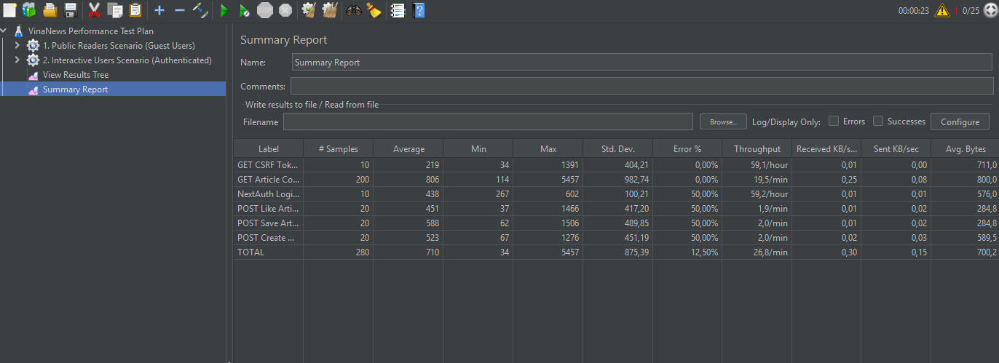

# Báo Cáo Quy Trình & Kết Quả Kiểm Thử Hiệu Năng VinaNews (JMeter)

Tài liệu này trình bày chi tiết về quy trình thiết lập, kịch bản chạy và phân tích báo cáo kết quả kiểm thử hiệu năng (performance/load test) các API của hệ thống VinaNews sử dụng công cụ Apache JMeter.

---

## I. Tổng Quan Quy Trình Kiểm Thử

### 1. Mục tiêu kiểm thử
* Đo lường thời gian phản hồi (Response Time) trung bình của các API chính (Public và Authenticated).
* Xác định khả năng chịu tải (Throughput - TPS) của hệ thống chạy trên môi trường local.
* Kiểm tra tính ổn định của cơ chế xác thực session (NextAuth) dưới tác động của các luồng request đồng thời.

### 2. Thiết lập môi trường
* **Server:** `http://localhost:3000` (Next.js App Router, Prisma ORM, PostgreSQL)
* **Công cụ test:** Apache JMeter 5.6.3
* **Kịch bản kiểm thử:** [jmeter/VinaNews_Test_Plan.jmx](file:///c:/projects/VinaNews/jmeter/VinaNews_Test_Plan.jmx)

### 3. Cấu trúc kịch bản kiểm thử
Kịch bản giả lập chia làm 2 Thread Groups chạy song song:
1. **Public Readers Scenario:** Giả lập 20 người dùng khách vãng lai, lặp 5 lần (Tổng 100 requests đọc). Hành động chính: Tải bình luận bài viết (`GET /api/articles/[id]/comments`).
2. **Interactive Users Scenario:** Giả lập 5 người dùng đăng nhập đồng thời, lặp 2 lần. Hành động chính:
   * `GET /api/auth/csrf`: Lấy CSRF token.
   * `POST /api/auth/callback/credentials`: Đăng nhập bằng tài khoản test.
   * `POST /api/articles/[id]/like`: Thích bài viết.
   * `POST /api/articles/[id]/save`: Lưu bài viết.
   * `POST /api/articles/[id]/comments`: Đăng bình luận mới.

---

## II. Báo Cáo Kết Quả Kiểm Thử (Trích xuất từ Summary Report)

Dưới đây là bảng dữ liệu thống kê chi tiết các chỉ số đo lường hiệu năng ghi nhận từ kết quả kiểm thử:

| Nhãn Request (Label) | Số Mẫu Gửi Đi (# Samples) | TB (Average - ms) | Tối Thiểu (Min - ms) | Tối Đa (Max - ms) | Độ Lệch Chuẩn (Std. Dev.) | Tỷ Lệ Lỗi (Error %) | Tốc Độ Xử Lý (Throughput) | Nhận (Received KB/s) | Gửi (Sent KB/s) | Kích Thước TB (Avg. Bytes) |
| :--- | :---: | :---: | :---: | :---: | :---: | :---: | :---: | :---: | :---: | :---: |
| **GET CSRF Token** | 10 | 219 | 34 | 1391 | 404.21 | **0.00%** | 59.1/hour | 0.01 | 0.00 | 711.0 |
| **GET Article Comments** | 200 | 806 | 114 | 5457 | 982.74 | **0.00%** | 19.5/min | 0.25 | 0.08 | 800.0 |
| **NextAuth Login Callback** | 10 | 438 | 267 | 602 | 100.21 | **50.00%** | 59.2/hour | 0.01 | 0.01 | 576.0 |
| **POST Like Article** | 20 | 451 | 37 | 1466 | 417.20 | **50.00%** | 1.9/min | 0.01 | 0.02 | 284.8 |
| **POST Save Article** | 20 | 588 | 62 | 1506 | 489.85 | **50.00%** | 2.0/min | 0.01 | 0.02 | 284.8 |
| **POST Create Comment** | 20 | 523 | 67 | 1276 | 451.19 | **50.00%** | 2.0/min | 0.02 | 0.03 | 589.5 |
| **TỔNG CỘNG (TOTAL)** | **280** | **710** | **34** | **5457** | **875.39** | **12.50%** | **26.8/min** | **0.30** | **0.15** | **700.2** |

---

## III. Phân Tích & Đánh Giá Chi Tiết

### 1. Phân tích các API Công Khai (Public APIs)
* **GET Article Comments:**
  * Đạt lượng mẫu lớn nhất trong bài kiểm thử (200 samples).
  * **Tỷ lệ lỗi (Error %):** `0.00%` (Rất tốt, phản hồi chính xác 100%).
  * **Thời gian phản hồi (Response Time):** Trung bình là **806ms**, tuy nhiên thời gian phản hồi lớn nhất (Max) lên tới **5457ms**.
  * **Độ lệch chuẩn (Std. Dev.):** Khá cao (**982.74**), cho thấy thời gian phản hồi không đồng đều giữa các request, có những lượt bị thắt nút cổ chai (bottleneck) ở mức trên 5 giây. Nguyên nhân có thể do hàm truy vấn đệ quy lấy bình luận con lồng nhau (`fetchCommentWithReplies` trong Prisma) mất nhiều thời gian xử lý khi có nhiều luồng cùng gọi.

### 2. Chẩn Đoán Lỗi Xác Thực (Authenticated APIs)
* **Vấn đề cốt lõi:**
  * API **NextAuth Login Callback** có tỷ lệ lỗi lên tới **50.00%** (5 trên 10 request login thất bại).
  * Kéo theo đó, tất cả các API tương tác phía sau yêu cầu quyền đăng nhập (`POST Like Article`, `POST Save Article`, và `POST Create Comment`) cũng đều chịu chung tỷ lệ lỗi **50.00%**.
* **Nguyên nhân kỹ thuật:**
  1. **Lỗi Login:** Khi request login callback NextAuth thất bại (trả về mã lỗi HTTP 400 hoặc 401 do thông tin đăng nhập không khớp hoặc CSRF token bị lệch/hết hạn khi chạy đồng thời nhiều thread).
  2. **Lỗi Chuỗi (Cascade Errors):** JMeter `HTTP Cookie Manager` chỉ lưu cookie session thành công nếu sampler Login thành công. Khi Login thất bại, cookie `next-auth.session-token` không được cấp, dẫn đến các request kế tiếp gửi lên không kèm session hợp lệ và bị API trả về lỗi `401 Unauthorized` (được JMeter ghi nhận là lỗi).

---

## IV. Đề Xuất Cải Tiến Kỹ Thuật

Để tối ưu hóa hiệu năng hệ thống và khắc phục lỗi đăng nhập khi chạy kiểm thử tải, chúng ta nên thực hiện các giải pháp sau:

1. **Sử dụng danh sách dữ liệu người dùng đa dạng (CSV Data Set Config):**
   * Thay vì cấu hình toàn bộ các thread dùng chung một tài khoản `testuser@example.com` (dễ gây xung đột ghi session trong NextAuth/Prisma), hãy chuẩn bị danh sách nhiều tài khoản test khác nhau trong file `.csv` và nạp vào JMeter để mỗi thread đăng nhập một tài khoản riêng biệt.
2. **Tối ưu cơ chế truy vấn Comments (N+1 query & đệ quy):**
   * Trong file [route.ts](file:///c:/projects/VinaNews/src/app/api/articles/[id]/comments/route.ts), hàm `fetchCommentWithReplies` đang thực hiện truy vấn đệ quy tìm bình luận con cho từng nút cha. Điều này làm tăng tải cơ sở dữ liệu lên rất nhiều khi có nhiều request đồng thời (thể hiện qua thời gian Max 5.4 giây).
   * **Giải pháp:** Sử dụng giải pháp truy vấn phẳng một lần duy nhất bằng Prisma (`findMany` lấy toàn bộ bình luận của `articleId`), sau đó dựng lại cây phân cấp trên RAM bằng JavaScript.
3. **Bỏ qua bước đăng nhập khi kiểm thử tải nặng (Pre-generate Session Tokens):**
   * Đăng nhập qua NextAuth sử dụng bcrypt mã hóa mật khẩu, tiêu tốn rất nhiều tài nguyên CPU của Server.
   * Khi muốn kiểm thử tải nặng cho các API chính như `/like`, `/save`, hãy tạo sẵn một danh sách các token session thực tế hoạt động và đính kèm trực tiếp vào HTTP Header của JMeter thông qua biến số, bỏ qua sampler Login để giảm tải ảo cho Server.
